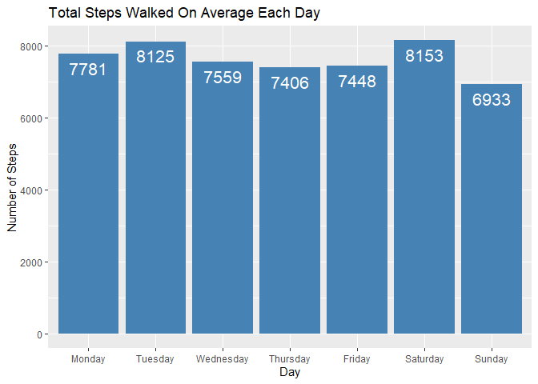
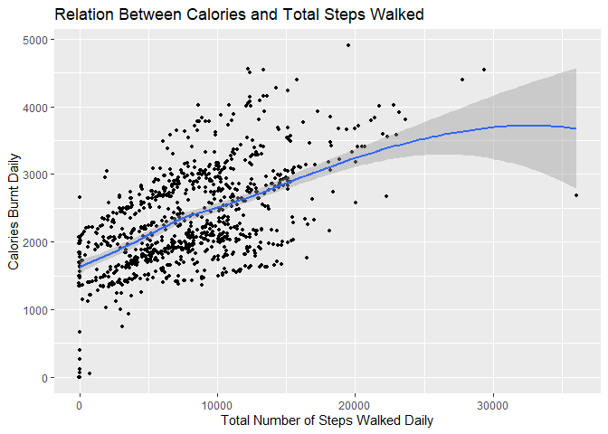
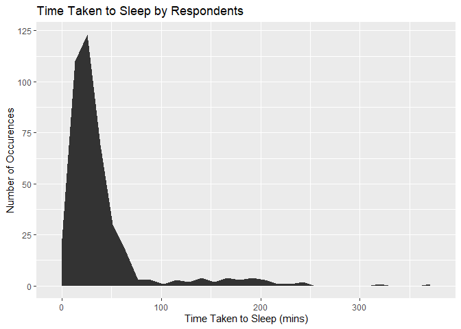
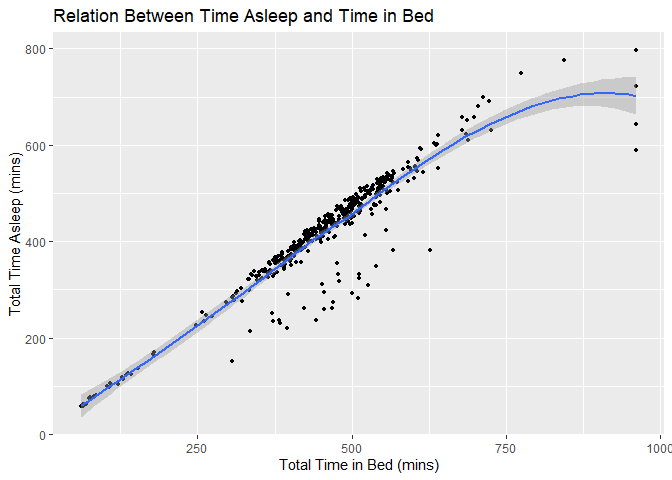

Case Study 2
================

# Case Study 2: How Can a Wellness Technology Company Play It Smart?

## Background

### Scenario

You are a junior data analyst working on the marketing analyst team at
Bellabeat, a high-tech manufacturer of health-focused products for
women. Bellabeat is a successful small company, but they have the
potential to become a larger player in the global smart device market.
Urška Sršen, cofounder and Chief Creative Officer of Bellabeat, believes
that analyzing smart device fitness data could help unlock new growth
opportunities for the company. You have been asked to focus on one of
Bellabeat’s products and analyze smart device data to gain insight into
how consumers are using their smart devices. The insights you discover
will then help guide marketing strategy for the company. You will
present your analysis to the Bellabeat executive team along with your
high-level recommendations for Bellabeat’s marketing strategy.

### Characters and Products

#### 1. Characters

- **Urška Sršen**: Bellabeat’s cofounder and Chief Creative Officer
- **Sando Mur**: Mathematician and Bellabeat’s cofounder; key member of
  the Bellabeat executive team
- **Bellabeat marketing analytics team**: A team of data analysts
  responsible for collecting, analyzing, and reporting data that helps
  guide Bellabeat’s marketing strategy. You joined this team six months
  ago and have been busy learning about Bellabeat’s mission and business
  goals — as well as how you, as a junior data analyst, can help
  Bellabeat achieve them.

#### 2. Products

- **Bellabeat app**: The Bellabeat app provides users with health data
  related to their activity, sleep, stress, menstrual cycle, and
  mindfulness habits. This data can help users better understand their
  current habits and make healthy decisions. The Bellabeat app connects
  to their line of smart wellness products.
- **Leaf**: Bellabeat’s classic wellness tracker can be worn as a
  bracelet, necklace, or clip. The Leaf tracker connects to the
  Bellabeat app to track activity, sleep, and stress.
- **Time**: This wellness watch combines the timeless look of a classic
  timepiece with smart technology to track user activity, sleep, and
  stress. The Time watch connects to the Bellabeat app to provide you
  with insights into your daily wellness.
- **Spring**: This is a water bottle that tracks daily water intake
  using smart technology to ensure that you are appropriately hydrated
  throughout the day. The Spring bottle connects to the Bellabeat app to
  track your hydration levels.
- **Bellabeat membership**: Bellabeat also offers a subscription-based
  membership program for users. Membership gives users 24/7 access to
  fully personalized guidance on nutrition, activity, sleep, health and
  beauty, and mindfulness based on their lifestyle and goals.

### About the company

Urška Sršen and Sando Mur founded Bellabeat, a high-tech company that
manufactures health-focused smart products. Sršen used her background as
an artist to develop beautifully designed technology that informs and
inspires women around the world. Collecting data on activity, sleep,
stress, and reproductive health has allowed Bellabeat to empower women
with knowledge about their own health and habits. Since it was founded
in 2013, Bellabeat has grown rapidly and quickly positioned itself as a
tech-driven wellness company for women.

By 2016, Bellabeat had opened offices around the world and launched
multiple products. Bellabeat products became available through a growing
number of online retailers in addition to their own e-commerce channel
on their website. The company has invested in traditional advertising
media, such as radio, out-of-home billboards, print, and television, but
focuses on digital marketing extensively. Bellabeat invests year-round
in Google Search, maintaining active Facebook and Instagram pages, and
consistently engages consumers on Twitter. Additionally, Bellabeat runs
video ads on Youtube and display ads on the Google Display Network to
support campaigns around key marketing dates.

Sršen knows that an analysis of Bellabeat’s available consumer data
would reveal more opportunities for growth. She has asked the marketing
analytics team to focus on a Bellabeat product and analyze smart device
usage data in order to gain insight into how people are already using
their smart devices. Then, using this information, she would like
high-level recommendations for how these trends can inform Bellabeat
marketing strategy.

### Goal Of the Case Study

Sršen asks you to analyze smart device usage data in order to gain
insight into how consumers use non-Bellabeat smart devices. She then
wants you to select one Bellabeat product to apply these insights to in
your presentation. These questions will guide your analysis: 1. What are
some trends in smart device usage? 2. How could these trends apply to
Bellabeat customers? 3. How could these trends help influence Bellabeat
marketing strategy? You will produce a report with the following
deliverables: 1. A clear summary of the business task 2. A description
of all data sources used 3. Documentation of any cleaning or
manipulation of data 4. A summary of your analysis 5. Supporting
visualizations and key findings 6. Your top high-level content
recommendations based on your analysis

### Steps Of Analysis

#### Ask Phase

##### 1. Business Task

The goal of this analysis is to find new opportunities for growth of
Bellabeat’s sales by analyzing consumers other than those using
Bellabeat to improve marketing strategies for Bellabeat products.

#### 2. Key Stakeholders

The **key stakeholders** are:

- Urška Sršen (co-founder, chief creative officer)
- Sando Mur (co-founder, key member of executive team and mathematician)
- Bellabeat marketing analytics team (jobscope involves collecting,
  analyzing and reporting data)

#### Prepare Phase

##### Download and Preview the data

Data was downloaded from [this
link](https://www.kaggle.com/datasets/arashnic/fitbit).

We will be using the CSV data that contain the users’ daily activity,
calories, intensities, steps, and sleep as the goal of this case study
is to understand more about the daily routines of smart device users.
The weight log, heart rate, and METs data will also be used in our
analysis to increase its thoroughness.

``` r
#Load appropriate libraries
library(tidyverse)
```

    ## ── Attaching core tidyverse packages ──────────────────────── tidyverse 2.0.0 ──
    ## ✔ dplyr     1.1.4     ✔ readr     2.1.4
    ## ✔ forcats   1.0.0     ✔ stringr   1.5.1
    ## ✔ ggplot2   3.4.4     ✔ tibble    3.2.1
    ## ✔ lubridate 1.9.3     ✔ tidyr     1.3.0
    ## ✔ purrr     1.0.2     
    ## ── Conflicts ────────────────────────────────────────── tidyverse_conflicts() ──
    ## ✖ dplyr::filter() masks stats::filter()
    ## ✖ dplyr::lag()    masks stats::lag()
    ## ℹ Use the conflicted package (<http://conflicted.r-lib.org/>) to force all conflicts to become errors

``` r
library(readr)
library(dplyr)
library(ggplot2)
```

``` r
# load the csv files needed for this case study
daily_activity_table <- read_csv('../Case-Study-2/Fitabase Data 4.12.16-5.12.16/dailyActivity_merged.csv')
```

    ## Rows: 940 Columns: 15
    ## ── Column specification ────────────────────────────────────────────────────────
    ## Delimiter: ","
    ## chr  (1): ActivityDate
    ## dbl (14): Id, TotalSteps, TotalDistance, TrackerDistance, LoggedActivitiesDi...
    ## 
    ## ℹ Use `spec()` to retrieve the full column specification for this data.
    ## ℹ Specify the column types or set `show_col_types = FALSE` to quiet this message.

``` r
daily_calories_table <- read_csv('../Case-Study-2/Fitabase Data 4.12.16-5.12.16/dailyCalories_merged.csv')
```

    ## Rows: 940 Columns: 3
    ## ── Column specification ────────────────────────────────────────────────────────
    ## Delimiter: ","
    ## chr (1): ActivityDay
    ## dbl (2): Id, Calories
    ## 
    ## ℹ Use `spec()` to retrieve the full column specification for this data.
    ## ℹ Specify the column types or set `show_col_types = FALSE` to quiet this message.

``` r
daily_intensities_table <- read_csv('../Case-Study-2/Fitabase Data 4.12.16-5.12.16/dailyIntensities_merged.csv')
```

    ## Rows: 940 Columns: 10
    ## ── Column specification ────────────────────────────────────────────────────────
    ## Delimiter: ","
    ## chr (1): ActivityDay
    ## dbl (9): Id, SedentaryMinutes, LightlyActiveMinutes, FairlyActiveMinutes, Ve...
    ## 
    ## ℹ Use `spec()` to retrieve the full column specification for this data.
    ## ℹ Specify the column types or set `show_col_types = FALSE` to quiet this message.

``` r
daily_steps_table <- read_csv('../Case-Study-2/Fitabase Data 4.12.16-5.12.16/dailySteps_merged.csv')
```

    ## Rows: 940 Columns: 3
    ## ── Column specification ────────────────────────────────────────────────────────
    ## Delimiter: ","
    ## chr (1): ActivityDay
    ## dbl (2): Id, StepTotal
    ## 
    ## ℹ Use `spec()` to retrieve the full column specification for this data.
    ## ℹ Specify the column types or set `show_col_types = FALSE` to quiet this message.

``` r
daily_sleep_table <- read_csv('../Case-Study-2/Fitabase Data 4.12.16-5.12.16/sleepDay_merged.csv')
```

    ## Rows: 413 Columns: 5
    ## ── Column specification ────────────────────────────────────────────────────────
    ## Delimiter: ","
    ## chr (1): SleepDay
    ## dbl (4): Id, TotalSleepRecords, TotalMinutesAsleep, TotalTimeInBed
    ## 
    ## ℹ Use `spec()` to retrieve the full column specification for this data.
    ## ℹ Specify the column types or set `show_col_types = FALSE` to quiet this message.

``` r
seconds_heartrate_table <- read_csv('../Case-Study-2/Fitabase Data 4.12.16-5.12.16/heartrate_seconds_merged.csv')
```

    ## Rows: 2483658 Columns: 3
    ## ── Column specification ────────────────────────────────────────────────────────
    ## Delimiter: ","
    ## chr (1): Time
    ## dbl (2): Id, Value
    ## 
    ## ℹ Use `spec()` to retrieve the full column specification for this data.
    ## ℹ Specify the column types or set `show_col_types = FALSE` to quiet this message.

``` r
minute_mets_table <- read_csv('../Case-Study-2/Fitabase Data 4.12.16-5.12.16/minuteMETsNarrow_merged.csv')
```

    ## Rows: 1325580 Columns: 3
    ## ── Column specification ────────────────────────────────────────────────────────
    ## Delimiter: ","
    ## chr (1): ActivityMinute
    ## dbl (2): Id, METs
    ## 
    ## ℹ Use `spec()` to retrieve the full column specification for this data.
    ## ℹ Specify the column types or set `show_col_types = FALSE` to quiet this message.

``` r
weight_log_table <- read_csv('../Case-Study-2/Fitabase Data 4.12.16-5.12.16/weightLogInfo_merged.csv')
```

    ## Rows: 67 Columns: 8
    ## ── Column specification ────────────────────────────────────────────────────────
    ## Delimiter: ","
    ## chr (1): Date
    ## dbl (6): Id, WeightKg, WeightPounds, Fat, BMI, LogId
    ## lgl (1): IsManualReport
    ## 
    ## ℹ Use `spec()` to retrieve the full column specification for this data.
    ## ℹ Specify the column types or set `show_col_types = FALSE` to quiet this message.

``` r
# preview the tables in the dataset
head(daily_activity_table)
```

    ## # A tibble: 6 × 15
    ##           Id ActivityDate TotalSteps TotalDistance TrackerDistance
    ##        <dbl> <chr>             <dbl>         <dbl>           <dbl>
    ## 1 1503960366 4/12/2016         13162          8.5             8.5 
    ## 2 1503960366 4/13/2016         10735          6.97            6.97
    ## 3 1503960366 4/14/2016         10460          6.74            6.74
    ## 4 1503960366 4/15/2016          9762          6.28            6.28
    ## 5 1503960366 4/16/2016         12669          8.16            8.16
    ## 6 1503960366 4/17/2016          9705          6.48            6.48
    ## # ℹ 10 more variables: LoggedActivitiesDistance <dbl>,
    ## #   VeryActiveDistance <dbl>, ModeratelyActiveDistance <dbl>,
    ## #   LightActiveDistance <dbl>, SedentaryActiveDistance <dbl>,
    ## #   VeryActiveMinutes <dbl>, FairlyActiveMinutes <dbl>,
    ## #   LightlyActiveMinutes <dbl>, SedentaryMinutes <dbl>, Calories <dbl>

``` r
head(daily_calories_table)
```

    ## # A tibble: 6 × 3
    ##           Id ActivityDay Calories
    ##        <dbl> <chr>          <dbl>
    ## 1 1503960366 4/12/2016       1985
    ## 2 1503960366 4/13/2016       1797
    ## 3 1503960366 4/14/2016       1776
    ## 4 1503960366 4/15/2016       1745
    ## 5 1503960366 4/16/2016       1863
    ## 6 1503960366 4/17/2016       1728

``` r
head(daily_intensities_table)
```

    ## # A tibble: 6 × 10
    ##         Id ActivityDay SedentaryMinutes LightlyActiveMinutes FairlyActiveMinutes
    ##      <dbl> <chr>                  <dbl>                <dbl>               <dbl>
    ## 1   1.50e9 4/12/2016                728                  328                  13
    ## 2   1.50e9 4/13/2016                776                  217                  19
    ## 3   1.50e9 4/14/2016               1218                  181                  11
    ## 4   1.50e9 4/15/2016                726                  209                  34
    ## 5   1.50e9 4/16/2016                773                  221                  10
    ## 6   1.50e9 4/17/2016                539                  164                  20
    ## # ℹ 5 more variables: VeryActiveMinutes <dbl>, SedentaryActiveDistance <dbl>,
    ## #   LightActiveDistance <dbl>, ModeratelyActiveDistance <dbl>,
    ## #   VeryActiveDistance <dbl>

``` r
head(daily_sleep_table)
```

    ## # A tibble: 6 × 5
    ##           Id SleepDay        TotalSleepRecords TotalMinutesAsleep TotalTimeInBed
    ##        <dbl> <chr>                       <dbl>              <dbl>          <dbl>
    ## 1 1503960366 4/12/2016 12:0…                 1                327            346
    ## 2 1503960366 4/13/2016 12:0…                 2                384            407
    ## 3 1503960366 4/15/2016 12:0…                 1                412            442
    ## 4 1503960366 4/16/2016 12:0…                 2                340            367
    ## 5 1503960366 4/17/2016 12:0…                 1                700            712
    ## 6 1503960366 4/19/2016 12:0…                 1                304            320

``` r
head(daily_steps_table)
```

    ## # A tibble: 6 × 3
    ##           Id ActivityDay StepTotal
    ##        <dbl> <chr>           <dbl>
    ## 1 1503960366 4/12/2016       13162
    ## 2 1503960366 4/13/2016       10735
    ## 3 1503960366 4/14/2016       10460
    ## 4 1503960366 4/15/2016        9762
    ## 5 1503960366 4/16/2016       12669
    ## 6 1503960366 4/17/2016        9705

``` r
head(minute_mets_table)
```

    ## # A tibble: 6 × 3
    ##           Id ActivityMinute         METs
    ##        <dbl> <chr>                 <dbl>
    ## 1 1503960366 4/12/2016 12:00:00 AM    10
    ## 2 1503960366 4/12/2016 12:01:00 AM    10
    ## 3 1503960366 4/12/2016 12:02:00 AM    10
    ## 4 1503960366 4/12/2016 12:03:00 AM    10
    ## 5 1503960366 4/12/2016 12:04:00 AM    10
    ## 6 1503960366 4/12/2016 12:05:00 AM    12

``` r
head(seconds_heartrate_table)
```

    ## # A tibble: 6 × 3
    ##           Id Time                 Value
    ##        <dbl> <chr>                <dbl>
    ## 1 2022484408 4/12/2016 7:21:00 AM    97
    ## 2 2022484408 4/12/2016 7:21:05 AM   102
    ## 3 2022484408 4/12/2016 7:21:10 AM   105
    ## 4 2022484408 4/12/2016 7:21:20 AM   103
    ## 5 2022484408 4/12/2016 7:21:25 AM   101
    ## 6 2022484408 4/12/2016 7:22:05 AM    95

``` r
head(weight_log_table)
```

    ## # A tibble: 6 × 8
    ##           Id Date       WeightKg WeightPounds   Fat   BMI IsManualReport   LogId
    ##        <dbl> <chr>         <dbl>        <dbl> <dbl> <dbl> <lgl>            <dbl>
    ## 1 1503960366 5/2/2016 …     52.6         116.    22  22.6 TRUE           1.46e12
    ## 2 1503960366 5/3/2016 …     52.6         116.    NA  22.6 TRUE           1.46e12
    ## 3 1927972279 4/13/2016…    134.          294.    NA  47.5 FALSE          1.46e12
    ## 4 2873212765 4/21/2016…     56.7         125.    NA  21.5 TRUE           1.46e12
    ## 5 2873212765 5/12/2016…     57.3         126.    NA  21.7 TRUE           1.46e12
    ## 6 4319703577 4/17/2016…     72.4         160.    25  27.5 TRUE           1.46e12

##### Bias and Credibility

###### ROCCC Check

**1. Reliable:**This dataset is generated by respondents to a
distributed survey via Amazon Mechanical Turk between
03.12.2016-05.12.2016. Not much detail is provided about this dataset.
Unlike government or organisational data from reputed organisations,
we’re unable to determine whether this dataset is credible or not.
Hence, it is **not entirely reliable.**

**2. Original:** The data used is **not original** as it is sourced from
a public dataset.

**3. Comprehensive:** Information about the respondents, such as their
race/ socio-economic background/ age/ gender was not provided, hence the
comprehensiveness of the data is difficult to determine. Nevertheless,
the data is **likely not very comprehensive** as only 30 respondents
were included, making it unlikely that the data covers a wide range of
backgrounds amongst respondents.

**4. Current:** Data was collected between 03.12.2016-05.12.2016.
Therfore, it is **slightly outdated** with respect to current times.

**5. Cited:** **No information** was given to determine whether the
dataset had been widely cited.

**Conclusion:** The Data has significant bias and lacks credbility.

#### Process Phase

Checking the Data for Errors and Cleaning the Data We will be checking
the following:

1.  Duplicated data
2.  Irrelevant data
3.  Inconsistency in the number of rows
4.  Inconsistency in the number of participants
5.  NULL values
6.  Missing values
7.  Incorrect/ unrealistic data

``` r
# 1. Duplicated data
# We remove any potential duplicated rows in each table 
daily_activity_table <- daily_activity_table[!duplicated(daily_activity_table),]
sum(duplicated(daily_activity_table))
```

    ## [1] 0

``` r
daily_calories_table <- daily_calories_table[!duplicated(daily_calories_table),]
sum(duplicated(daily_calories_table))
```

    ## [1] 0

``` r
daily_intensities_table <- daily_intensities_table[!duplicated(daily_intensities_table),]
sum(duplicated(daily_intensities_table))
```

    ## [1] 0

``` r
daily_sleep_table <- daily_sleep_table[!duplicated(daily_sleep_table),]
sum(duplicated(daily_sleep_table))
```

    ## [1] 0

``` r
daily_steps_table <- daily_steps_table[!duplicated(daily_steps_table),]
sum(duplicated(daily_steps_table))
```

    ## [1] 0

``` r
minute_mets_table <- minute_mets_table[!duplicated(minute_mets_table),]
sum(duplicated(minute_mets_table))
```

    ## [1] 0

``` r
seconds_heartrate_table <- seconds_heartrate_table[!duplicated(seconds_heartrate_table),]
sum(duplicated(seconds_heartrate_table))
```

    ## [1] 0

``` r
weight_log_table <- weight_log_table[!duplicated(weight_log_table),]
sum(duplicated(weight_log_table))
```

    ## [1] 0

``` r
# 2. Irrelevant data (checking that all Dates are between 03.12.2016-05.12.2016)
# split up date and time
updated_daily_sleep_table <- daily_sleep_table %>% 
    separate(SleepDay, c("Date", "Time"), " ")
```

    ## Warning: Expected 2 pieces. Additional pieces discarded in 410 rows [1, 2, 3, 4, 5, 6,
    ## 7, 8, 9, 10, 11, 12, 13, 14, 15, 16, 17, 18, 19, 20, ...].

``` r
updated_seconds_heartrate_table <- seconds_heartrate_table %>% 
    separate(Time, c("Date", "Time"), " ")
```

    ## Warning: Expected 2 pieces. Additional pieces discarded in 2483658 rows [1, 2, 3, 4, 5,
    ## 6, 7, 8, 9, 10, 11, 12, 13, 14, 15, 16, 17, 18, 19, 20, ...].

``` r
updated_minute_mets_table <- minute_mets_table %>% 
    separate(ActivityMinute, c("Date", "Time"), " ")
```

    ## Warning: Expected 2 pieces. Additional pieces discarded in 1325580 rows [1, 2, 3, 4, 5,
    ## 6, 7, 8, 9, 10, 11, 12, 13, 14, 15, 16, 17, 18, 19, 20, ...].

``` r
updated_weight_log_table <- weight_log_table %>% 
    separate(Date, c("Date", "Time"), " ")
```

    ## Warning: Expected 2 pieces. Additional pieces discarded in 67 rows [1, 2, 3, 4, 5, 6, 7,
    ## 8, 9, 10, 11, 12, 13, 14, 15, 16, 17, 18, 19, 20, ...].

``` r
# change all 'ActivityDate' and 'ActivityDay' columns to 'Date'
updated_daily_activity_table <- rename(daily_activity_table, Date = ActivityDate)
updated_daily_calories_table <- rename(daily_calories_table, Date = ActivityDay)
updated_daily_intensities_table <- rename(daily_intensities_table, Date = ActivityDay)
updated_daily_steps_table <- rename(daily_steps_table, Date = ActivityDay)
```

``` r
# change all 'Date' columns from 'chr' data type to 'date' type
library(lubridate)
updated_daily_activity_table$Date <- mdy(updated_daily_activity_table$Date)
updated_daily_calories_table$Date <- mdy(updated_daily_calories_table$Date)
updated_daily_intensities_table$Date <- mdy(updated_daily_intensities_table$Date)
updated_daily_steps_table$Date <- mdy(updated_daily_steps_table$Date)
updated_daily_sleep_table$Date <- mdy(updated_daily_sleep_table$Date)
updated_seconds_heartrate_table$Date <- mdy(updated_seconds_heartrate_table$Date)
updated_minute_mets_table$Date <- mdy(updated_minute_mets_table$Date)
updated_weight_log_table$Date <- mdy(updated_weight_log_table$Date)
```

``` r
# 2. Irrelevant data (checking that all Dates are between 03.12.2016-05.12.2016) cont.
# order the dates
ordered_daily_activity_table <- updated_daily_activity_table[order(updated_daily_activity_table$Date), ]
# check the first and last row to see if the earliest and latest recorded dates fall within the given period
head(ordered_daily_activity_table, n = 1)
```

    ## # A tibble: 1 × 15
    ##           Id Date       TotalSteps TotalDistance TrackerDistance
    ##        <dbl> <date>          <dbl>         <dbl>           <dbl>
    ## 1 1503960366 2016-04-12      13162           8.5             8.5
    ## # ℹ 10 more variables: LoggedActivitiesDistance <dbl>,
    ## #   VeryActiveDistance <dbl>, ModeratelyActiveDistance <dbl>,
    ## #   LightActiveDistance <dbl>, SedentaryActiveDistance <dbl>,
    ## #   VeryActiveMinutes <dbl>, FairlyActiveMinutes <dbl>,
    ## #   LightlyActiveMinutes <dbl>, SedentaryMinutes <dbl>, Calories <dbl>

``` r
tail(ordered_daily_activity_table, n = 1)
```

    ## # A tibble: 1 × 15
    ##           Id Date       TotalSteps TotalDistance TrackerDistance
    ##        <dbl> <date>          <dbl>         <dbl>           <dbl>
    ## 1 8877689391 2016-05-12       8064          6.12            6.12
    ## # ℹ 10 more variables: LoggedActivitiesDistance <dbl>,
    ## #   VeryActiveDistance <dbl>, ModeratelyActiveDistance <dbl>,
    ## #   LightActiveDistance <dbl>, SedentaryActiveDistance <dbl>,
    ## #   VeryActiveMinutes <dbl>, FairlyActiveMinutes <dbl>,
    ## #   LightlyActiveMinutes <dbl>, SedentaryMinutes <dbl>, Calories <dbl>

``` r
ordered_daily_calories_table <- updated_daily_calories_table[order(updated_daily_calories_table$Date), ]
head(ordered_daily_calories_table, n = 1)
```

    ## # A tibble: 1 × 3
    ##           Id Date       Calories
    ##        <dbl> <date>        <dbl>
    ## 1 1503960366 2016-04-12     1985

``` r
tail(ordered_daily_calories_table, n = 1)
```

    ## # A tibble: 1 × 3
    ##           Id Date       Calories
    ##        <dbl> <date>        <dbl>
    ## 1 8877689391 2016-05-12     1849

``` r
ordered_daily_intensities_table <- updated_daily_intensities_table[order(updated_daily_intensities_table$Date), ]
head(ordered_daily_intensities_table, n = 1)
```

    ## # A tibble: 1 × 10
    ##          Id Date       SedentaryMinutes LightlyActiveMinutes FairlyActiveMinutes
    ##       <dbl> <date>                <dbl>                <dbl>               <dbl>
    ## 1    1.50e9 2016-04-12              728                  328                  13
    ## # ℹ 5 more variables: VeryActiveMinutes <dbl>, SedentaryActiveDistance <dbl>,
    ## #   LightActiveDistance <dbl>, ModeratelyActiveDistance <dbl>,
    ## #   VeryActiveDistance <dbl>

``` r
tail(ordered_daily_intensities_table, n = 1)
```

    ## # A tibble: 1 × 10
    ##          Id Date       SedentaryMinutes LightlyActiveMinutes FairlyActiveMinutes
    ##       <dbl> <date>                <dbl>                <dbl>               <dbl>
    ## 1    8.88e9 2016-05-12              770                  137                   1
    ## # ℹ 5 more variables: VeryActiveMinutes <dbl>, SedentaryActiveDistance <dbl>,
    ## #   LightActiveDistance <dbl>, ModeratelyActiveDistance <dbl>,
    ## #   VeryActiveDistance <dbl>

``` r
ordered_daily_steps_table <- updated_daily_steps_table[order(updated_daily_steps_table$Date), ]
head(ordered_daily_steps_table, n = 1)
```

    ## # A tibble: 1 × 3
    ##           Id Date       StepTotal
    ##        <dbl> <date>         <dbl>
    ## 1 1503960366 2016-04-12     13162

``` r
tail(ordered_daily_steps_table, n = 1)
```

    ## # A tibble: 1 × 3
    ##           Id Date       StepTotal
    ##        <dbl> <date>         <dbl>
    ## 1 8877689391 2016-05-12      8064

``` r
ordered_daily_sleep_table <- updated_daily_sleep_table[order(updated_daily_sleep_table$Date), ]
head(ordered_daily_sleep_table, n = 1)
```

    ## # A tibble: 1 × 6
    ##          Id Date       Time  TotalSleepRecords TotalMinutesAsleep TotalTimeInBed
    ##       <dbl> <date>     <chr>             <dbl>              <dbl>          <dbl>
    ## 1    1.50e9 2016-04-12 12:0…                 1                327            346

``` r
tail(ordered_daily_sleep_table, n = 1)
```

    ## # A tibble: 1 × 6
    ##          Id Date       Time  TotalSleepRecords TotalMinutesAsleep TotalTimeInBed
    ##       <dbl> <date>     <chr>             <dbl>              <dbl>          <dbl>
    ## 1    8.38e9 2016-05-12 12:0…                 1                496            546

``` r
ordered_seconds_heartrate_table <- updated_seconds_heartrate_table[order(updated_seconds_heartrate_table$Date), ]
head(ordered_seconds_heartrate_table, n = 1)
```

    ## # A tibble: 1 × 4
    ##           Id Date       Time    Value
    ##        <dbl> <date>     <chr>   <dbl>
    ## 1 2022484408 2016-04-12 7:21:00    97

``` r
tail(ordered_seconds_heartrate_table, n = 1)
```

    ## # A tibble: 1 × 4
    ##           Id Date       Time    Value
    ##        <dbl> <date>     <chr>   <dbl>
    ## 1 8877689391 2016-05-12 2:44:28    56

``` r
ordered_minute_mets_table <- updated_minute_mets_table[order(updated_minute_mets_table$Date), ]
head(ordered_minute_mets_table, n = 1)
```

    ## # A tibble: 1 × 4
    ##           Id Date       Time      METs
    ##        <dbl> <date>     <chr>    <dbl>
    ## 1 1503960366 2016-04-12 12:00:00    10

``` r
tail(ordered_minute_mets_table, n = 1)
```

    ## # A tibble: 1 × 4
    ##           Id Date       Time     METs
    ##        <dbl> <date>     <chr>   <dbl>
    ## 1 8877689391 2016-05-12 1:59:00    11

``` r
ordered_weight_log_table <- updated_weight_log_table[order(updated_weight_log_table$Date), ]
head(ordered_weight_log_table, n = 1)
```

    ## # A tibble: 1 × 9
    ##           Id Date       Time    WeightKg WeightPounds   Fat   BMI IsManualReport
    ##        <dbl> <date>     <chr>      <dbl>        <dbl> <dbl> <dbl> <lgl>         
    ## 1 6962181067 2016-04-12 11:59:…     62.5         138.    NA  24.4 TRUE          
    ## # ℹ 1 more variable: LogId <dbl>

``` r
tail(ordered_weight_log_table, n = 1)
```

    ## # A tibble: 1 × 9
    ##           Id Date       Time    WeightKg WeightPounds   Fat   BMI IsManualReport
    ##        <dbl> <date>     <chr>      <dbl>        <dbl> <dbl> <dbl> <lgl>         
    ## 1 8877689391 2016-05-12 6:42:53       84         185.    NA  25.1 FALSE         
    ## # ℹ 1 more variable: LogId <dbl>

``` r
# 3. Inconsistency in the number of rows
# We will first find the number of rows in each table 
nrow(ordered_daily_activity_table)
```

    ## [1] 940

``` r
nrow(ordered_daily_calories_table)
```

    ## [1] 940

``` r
nrow(ordered_daily_intensities_table)
```

    ## [1] 940

``` r
nrow(ordered_daily_steps_table)
```

    ## [1] 940

``` r
nrow(ordered_daily_sleep_table)
```

    ## [1] 410

``` r
nrow(ordered_seconds_heartrate_table)
```

    ## [1] 2483658

``` r
nrow(ordered_minute_mets_table)
```

    ## [1] 1325580

``` r
nrow(ordered_weight_log_table)
```

    ## [1] 67

The number of rows in the ordered_daily_sleep_table (410) is fewer than
the number of rows in the ordered_daily_activity_table,
ordered_daily_calories_table, ordered_daily_intensities_table and
ordered_daily_steps_table tables (940). There is hence missing data on
the participants’ sleep during the period of the survey.

The number of rows in the ordered_weight_log_table table (67) is much
fewer than the ordered_daily_activity_table table (940), suggesting that
most respondents did not enter their weight logs daily.

Since some data on the peoples’ sleep and weight log is missing, the
conclusion obtained based on these 2 tables may not be fully accurate.

``` r
# 4. Inconsistency in the number of participants
ordered_daily_activity_table$Id %>% n_distinct()
```

    ## [1] 33

``` r
ordered_daily_calories_table$Id %>% n_distinct()
```

    ## [1] 33

``` r
ordered_daily_intensities_table$Id %>% n_distinct()
```

    ## [1] 33

``` r
ordered_daily_steps_table$Id %>% n_distinct()
```

    ## [1] 33

``` r
ordered_daily_sleep_table$Id %>% n_distinct()
```

    ## [1] 24

``` r
ordered_seconds_heartrate_table$Id %>% n_distinct()
```

    ## [1] 14

``` r
ordered_minute_mets_table$Id %>% n_distinct()
```

    ## [1] 33

``` r
ordered_weight_log_table$Id %>% n_distinct()
```

    ## [1] 8

According to the description of the dataset, there should be 30
respondents and hence 30 unique Ids in each of the tables. Considering
how the data provided has such a wide variation of unique Ids (‘8’,
‘14’, ‘24’ and ‘33’), the dataset’s integrity might have been
compromised before being uploaded. This discrepancy reduces the
credibility of the analysis done based on this data.

``` r
# 5. NULL values
is.null(ordered_daily_activity_table)
```

    ## [1] FALSE

``` r
is.null(ordered_daily_calories_table)
```

    ## [1] FALSE

``` r
is.null(ordered_daily_intensities_table)
```

    ## [1] FALSE

``` r
is.null(ordered_daily_steps_table)
```

    ## [1] FALSE

``` r
is.null(ordered_daily_sleep_table)
```

    ## [1] FALSE

``` r
is.null(ordered_seconds_heartrate_table)
```

    ## [1] FALSE

``` r
is.null(ordered_minute_mets_table)
```

    ## [1] FALSE

``` r
is.null(ordered_weight_log_table)
```

    ## [1] FALSE

No NULL values are present in any of the tables.

``` r
# 6. Missing values
sum(is.na(ordered_daily_activity_table))
```

    ## [1] 0

``` r
sum(is.na(ordered_daily_calories_table))
```

    ## [1] 0

``` r
sum(is.na(ordered_daily_intensities_table))
```

    ## [1] 0

``` r
sum(is.na(ordered_daily_steps_table))
```

    ## [1] 0

``` r
sum(is.na(ordered_daily_sleep_table))
```

    ## [1] 0

``` r
sum(is.na(ordered_seconds_heartrate_table))
```

    ## [1] 0

``` r
sum(is.na(ordered_minute_mets_table))
```

    ## [1] 0

``` r
sum(is.na(ordered_weight_log_table))
```

    ## [1] 65

There are 65 missing values in the weight_log_table. We will list out
the missing values.

``` r
is.na(ordered_weight_log_table)
```

    ##          Id  Date  Time WeightKg WeightPounds   Fat   BMI IsManualReport LogId
    ##  [1,] FALSE FALSE FALSE    FALSE        FALSE  TRUE FALSE          FALSE FALSE
    ##  [2,] FALSE FALSE FALSE    FALSE        FALSE  TRUE FALSE          FALSE FALSE
    ##  [3,] FALSE FALSE FALSE    FALSE        FALSE  TRUE FALSE          FALSE FALSE
    ##  [4,] FALSE FALSE FALSE    FALSE        FALSE  TRUE FALSE          FALSE FALSE
    ##  [5,] FALSE FALSE FALSE    FALSE        FALSE  TRUE FALSE          FALSE FALSE
    ##  [6,] FALSE FALSE FALSE    FALSE        FALSE  TRUE FALSE          FALSE FALSE
    ##  [7,] FALSE FALSE FALSE    FALSE        FALSE  TRUE FALSE          FALSE FALSE
    ##  [8,] FALSE FALSE FALSE    FALSE        FALSE  TRUE FALSE          FALSE FALSE
    ##  [9,] FALSE FALSE FALSE    FALSE        FALSE  TRUE FALSE          FALSE FALSE
    ## [10,] FALSE FALSE FALSE    FALSE        FALSE  TRUE FALSE          FALSE FALSE
    ## [11,] FALSE FALSE FALSE    FALSE        FALSE FALSE FALSE          FALSE FALSE
    ## [12,] FALSE FALSE FALSE    FALSE        FALSE  TRUE FALSE          FALSE FALSE
    ## [13,] FALSE FALSE FALSE    FALSE        FALSE  TRUE FALSE          FALSE FALSE
    ## [14,] FALSE FALSE FALSE    FALSE        FALSE  TRUE FALSE          FALSE FALSE
    ## [15,] FALSE FALSE FALSE    FALSE        FALSE  TRUE FALSE          FALSE FALSE
    ## [16,] FALSE FALSE FALSE    FALSE        FALSE  TRUE FALSE          FALSE FALSE
    ## [17,] FALSE FALSE FALSE    FALSE        FALSE  TRUE FALSE          FALSE FALSE
    ## [18,] FALSE FALSE FALSE    FALSE        FALSE  TRUE FALSE          FALSE FALSE
    ## [19,] FALSE FALSE FALSE    FALSE        FALSE  TRUE FALSE          FALSE FALSE
    ## [20,] FALSE FALSE FALSE    FALSE        FALSE  TRUE FALSE          FALSE FALSE
    ## [21,] FALSE FALSE FALSE    FALSE        FALSE  TRUE FALSE          FALSE FALSE
    ## [22,] FALSE FALSE FALSE    FALSE        FALSE  TRUE FALSE          FALSE FALSE
    ## [23,] FALSE FALSE FALSE    FALSE        FALSE  TRUE FALSE          FALSE FALSE
    ## [24,] FALSE FALSE FALSE    FALSE        FALSE  TRUE FALSE          FALSE FALSE
    ## [25,] FALSE FALSE FALSE    FALSE        FALSE  TRUE FALSE          FALSE FALSE
    ## [26,] FALSE FALSE FALSE    FALSE        FALSE  TRUE FALSE          FALSE FALSE
    ## [27,] FALSE FALSE FALSE    FALSE        FALSE  TRUE FALSE          FALSE FALSE
    ## [28,] FALSE FALSE FALSE    FALSE        FALSE  TRUE FALSE          FALSE FALSE
    ## [29,] FALSE FALSE FALSE    FALSE        FALSE  TRUE FALSE          FALSE FALSE
    ## [30,] FALSE FALSE FALSE    FALSE        FALSE  TRUE FALSE          FALSE FALSE
    ## [31,] FALSE FALSE FALSE    FALSE        FALSE  TRUE FALSE          FALSE FALSE
    ## [32,] FALSE FALSE FALSE    FALSE        FALSE  TRUE FALSE          FALSE FALSE
    ## [33,] FALSE FALSE FALSE    FALSE        FALSE  TRUE FALSE          FALSE FALSE
    ## [34,] FALSE FALSE FALSE    FALSE        FALSE  TRUE FALSE          FALSE FALSE
    ## [35,] FALSE FALSE FALSE    FALSE        FALSE  TRUE FALSE          FALSE FALSE
    ## [36,] FALSE FALSE FALSE    FALSE        FALSE  TRUE FALSE          FALSE FALSE
    ## [37,] FALSE FALSE FALSE    FALSE        FALSE  TRUE FALSE          FALSE FALSE
    ## [38,] FALSE FALSE FALSE    FALSE        FALSE  TRUE FALSE          FALSE FALSE
    ## [39,] FALSE FALSE FALSE    FALSE        FALSE  TRUE FALSE          FALSE FALSE
    ## [40,] FALSE FALSE FALSE    FALSE        FALSE  TRUE FALSE          FALSE FALSE
    ## [41,] FALSE FALSE FALSE    FALSE        FALSE  TRUE FALSE          FALSE FALSE
    ## [42,] FALSE FALSE FALSE    FALSE        FALSE  TRUE FALSE          FALSE FALSE
    ## [43,] FALSE FALSE FALSE    FALSE        FALSE  TRUE FALSE          FALSE FALSE
    ## [44,] FALSE FALSE FALSE    FALSE        FALSE FALSE FALSE          FALSE FALSE
    ## [45,] FALSE FALSE FALSE    FALSE        FALSE  TRUE FALSE          FALSE FALSE
    ## [46,] FALSE FALSE FALSE    FALSE        FALSE  TRUE FALSE          FALSE FALSE
    ## [47,] FALSE FALSE FALSE    FALSE        FALSE  TRUE FALSE          FALSE FALSE
    ## [48,] FALSE FALSE FALSE    FALSE        FALSE  TRUE FALSE          FALSE FALSE
    ## [49,] FALSE FALSE FALSE    FALSE        FALSE  TRUE FALSE          FALSE FALSE
    ## [50,] FALSE FALSE FALSE    FALSE        FALSE  TRUE FALSE          FALSE FALSE
    ## [51,] FALSE FALSE FALSE    FALSE        FALSE  TRUE FALSE          FALSE FALSE
    ## [52,] FALSE FALSE FALSE    FALSE        FALSE  TRUE FALSE          FALSE FALSE
    ## [53,] FALSE FALSE FALSE    FALSE        FALSE  TRUE FALSE          FALSE FALSE
    ## [54,] FALSE FALSE FALSE    FALSE        FALSE  TRUE FALSE          FALSE FALSE
    ## [55,] FALSE FALSE FALSE    FALSE        FALSE  TRUE FALSE          FALSE FALSE
    ## [56,] FALSE FALSE FALSE    FALSE        FALSE  TRUE FALSE          FALSE FALSE
    ## [57,] FALSE FALSE FALSE    FALSE        FALSE  TRUE FALSE          FALSE FALSE
    ## [58,] FALSE FALSE FALSE    FALSE        FALSE  TRUE FALSE          FALSE FALSE
    ## [59,] FALSE FALSE FALSE    FALSE        FALSE  TRUE FALSE          FALSE FALSE
    ## [60,] FALSE FALSE FALSE    FALSE        FALSE  TRUE FALSE          FALSE FALSE
    ## [61,] FALSE FALSE FALSE    FALSE        FALSE  TRUE FALSE          FALSE FALSE
    ## [62,] FALSE FALSE FALSE    FALSE        FALSE  TRUE FALSE          FALSE FALSE
    ## [63,] FALSE FALSE FALSE    FALSE        FALSE  TRUE FALSE          FALSE FALSE
    ## [64,] FALSE FALSE FALSE    FALSE        FALSE  TRUE FALSE          FALSE FALSE
    ## [65,] FALSE FALSE FALSE    FALSE        FALSE  TRUE FALSE          FALSE FALSE
    ## [66,] FALSE FALSE FALSE    FALSE        FALSE  TRUE FALSE          FALSE FALSE
    ## [67,] FALSE FALSE FALSE    FALSE        FALSE  TRUE FALSE          FALSE FALSE

It seems like all the missing values are in the ‘Fat’ column, hence, We
will exclude the fat column and check for missing values.

``` r
ordered_weight_log_table %>% filter(!is.na(Fat))
```

    ## # A tibble: 2 × 9
    ##           Id Date       Time    WeightKg WeightPounds   Fat   BMI IsManualReport
    ##        <dbl> <date>     <chr>      <dbl>        <dbl> <dbl> <dbl> <lgl>         
    ## 1 4319703577 2016-04-17 11:59:…     72.4         160.    25  27.5 TRUE          
    ## 2 1503960366 2016-05-02 11:59:…     52.6         116.    22  22.6 TRUE          
    ## # ℹ 1 more variable: LogId <dbl>

Since the ‘Fat’ column only contains 2 rows of data, there is
insufficient data to analyze the respondents’ body fat throughout the
given period. We will thus remove the ‘Fat’ column from our analysis.

``` r
trimmed_weight_log_table <- subset(ordered_weight_log_table, select = -Fat)
```

``` r
sum(is.na(trimmed_weight_log_table))
```

    ## [1] 0

``` r
# 7. Incorrect/ unrealistic data

sorted_minute_mets_table <- ordered_minute_mets_table[order(ordered_minute_mets_table$METs), ]
head(sorted_minute_mets_table, n=15)
```

    ## # A tibble: 15 × 4
    ##            Id Date       Time      METs
    ##         <dbl> <date>     <chr>    <dbl>
    ##  1 1624580081 2016-04-21 11:59:00     0
    ##  2 2026352035 2016-04-23 11:59:00     0
    ##  3 8053475328 2016-04-26 11:59:00     0
    ##  4 7086361926 2016-04-29 6:14:00      0
    ##  5 7086361926 2016-05-06 6:25:00      0
    ##  6 7086361926 2016-05-06 11:59:00     0
    ##  7 4558609924 2016-05-11 11:59:00     0
    ##  8 1644430081 2016-05-08 11:59:00     6
    ##  9 1503960366 2016-04-12 12:00:00    10
    ## 10 1503960366 2016-04-12 12:01:00    10
    ## 11 1503960366 2016-04-12 12:02:00    10
    ## 12 1503960366 2016-04-12 12:03:00    10
    ## 13 1503960366 2016-04-12 12:04:00    10
    ## 14 1503960366 2016-04-12 12:12:00    10
    ## 15 1503960366 2016-04-12 12:13:00    10

One Metabolic Equivalent of Task (MET) is equal to the amount of energy
a person expends while sitting quietly. Sedentary, lightly intensive,
moderately intensive and vigorously intensive activities have METs in
the range of 1.5 or fewer, 1.6 - 3.0, 3.0 - 6.0 and more than 6.0 METs
respectively.

However, from the sorted_minute_mets_table table, we can see that,
excluding the erroneous records with MET values of ‘0’, the smallest MET
record is 6. The data collected is likely flawed as it is unrealistic
for the respondents to solely have such high MET values recorded over
the one-month period. This makes analyses based on the METs data flawed
and misleading, thus no credible insights can be drawn from the
sorted_minute_mets_table data. As such, We will not be analyzing the MET
data for this case study.

#### Analyze and Share Phase

\#####Gaining Insights From the Data: 1. Summarizing the Data 2.
Comparing Weekday vs Weekend Activity 3. Comparing Total Steps vs Total
Calories 4. Analyzing Sleep Data 5. Analyzing Heart rate Data 6.
Analyzing Weight Log Data

# 1. Summarizing the Data

# obtaining a high level summary of the datasets

``` r
sapply(list(ordered_daily_activity_table, ordered_daily_calories_table, ordered_daily_intensities_table,
            ordered_daily_steps_table, ordered_daily_sleep_table, ordered_seconds_heartrate_table,
            ordered_minute_mets_table, trimmed_weight_log_table), summary)
```

    ## [[1]]
    ##        Id                 Date              TotalSteps    TotalDistance   
    ##  Min.   :1.504e+09   Min.   :2016-04-12   Min.   :    0   Min.   : 0.000  
    ##  1st Qu.:2.320e+09   1st Qu.:2016-04-19   1st Qu.: 3790   1st Qu.: 2.620  
    ##  Median :4.445e+09   Median :2016-04-26   Median : 7406   Median : 5.245  
    ##  Mean   :4.855e+09   Mean   :2016-04-26   Mean   : 7638   Mean   : 5.490  
    ##  3rd Qu.:6.962e+09   3rd Qu.:2016-05-04   3rd Qu.:10727   3rd Qu.: 7.713  
    ##  Max.   :8.878e+09   Max.   :2016-05-12   Max.   :36019   Max.   :28.030  
    ##  TrackerDistance  LoggedActivitiesDistance VeryActiveDistance
    ##  Min.   : 0.000   Min.   :0.0000           Min.   : 0.000    
    ##  1st Qu.: 2.620   1st Qu.:0.0000           1st Qu.: 0.000    
    ##  Median : 5.245   Median :0.0000           Median : 0.210    
    ##  Mean   : 5.475   Mean   :0.1082           Mean   : 1.503    
    ##  3rd Qu.: 7.710   3rd Qu.:0.0000           3rd Qu.: 2.053    
    ##  Max.   :28.030   Max.   :4.9421           Max.   :21.920    
    ##  ModeratelyActiveDistance LightActiveDistance SedentaryActiveDistance
    ##  Min.   :0.0000           Min.   : 0.000      Min.   :0.000000       
    ##  1st Qu.:0.0000           1st Qu.: 1.945      1st Qu.:0.000000       
    ##  Median :0.2400           Median : 3.365      Median :0.000000       
    ##  Mean   :0.5675           Mean   : 3.341      Mean   :0.001606       
    ##  3rd Qu.:0.8000           3rd Qu.: 4.782      3rd Qu.:0.000000       
    ##  Max.   :6.4800           Max.   :10.710      Max.   :0.110000       
    ##  VeryActiveMinutes FairlyActiveMinutes LightlyActiveMinutes SedentaryMinutes
    ##  Min.   :  0.00    Min.   :  0.00      Min.   :  0.0        Min.   :   0.0  
    ##  1st Qu.:  0.00    1st Qu.:  0.00      1st Qu.:127.0        1st Qu.: 729.8  
    ##  Median :  4.00    Median :  6.00      Median :199.0        Median :1057.5  
    ##  Mean   : 21.16    Mean   : 13.56      Mean   :192.8        Mean   : 991.2  
    ##  3rd Qu.: 32.00    3rd Qu.: 19.00      3rd Qu.:264.0        3rd Qu.:1229.5  
    ##  Max.   :210.00    Max.   :143.00      Max.   :518.0        Max.   :1440.0  
    ##     Calories   
    ##  Min.   :   0  
    ##  1st Qu.:1828  
    ##  Median :2134  
    ##  Mean   :2304  
    ##  3rd Qu.:2793  
    ##  Max.   :4900  
    ## 
    ## [[2]]
    ##        Id                 Date               Calories   
    ##  Min.   :1.504e+09   Min.   :2016-04-12   Min.   :   0  
    ##  1st Qu.:2.320e+09   1st Qu.:2016-04-19   1st Qu.:1828  
    ##  Median :4.445e+09   Median :2016-04-26   Median :2134  
    ##  Mean   :4.855e+09   Mean   :2016-04-26   Mean   :2304  
    ##  3rd Qu.:6.962e+09   3rd Qu.:2016-05-04   3rd Qu.:2793  
    ##  Max.   :8.878e+09   Max.   :2016-05-12   Max.   :4900  
    ## 
    ## [[3]]
    ##        Id                 Date            SedentaryMinutes LightlyActiveMinutes
    ##  Min.   :1.504e+09   Min.   :2016-04-12   Min.   :   0.0   Min.   :  0.0       
    ##  1st Qu.:2.320e+09   1st Qu.:2016-04-19   1st Qu.: 729.8   1st Qu.:127.0       
    ##  Median :4.445e+09   Median :2016-04-26   Median :1057.5   Median :199.0       
    ##  Mean   :4.855e+09   Mean   :2016-04-26   Mean   : 991.2   Mean   :192.8       
    ##  3rd Qu.:6.962e+09   3rd Qu.:2016-05-04   3rd Qu.:1229.5   3rd Qu.:264.0       
    ##  Max.   :8.878e+09   Max.   :2016-05-12   Max.   :1440.0   Max.   :518.0       
    ##  FairlyActiveMinutes VeryActiveMinutes SedentaryActiveDistance
    ##  Min.   :  0.00      Min.   :  0.00    Min.   :0.000000       
    ##  1st Qu.:  0.00      1st Qu.:  0.00    1st Qu.:0.000000       
    ##  Median :  6.00      Median :  4.00    Median :0.000000       
    ##  Mean   : 13.56      Mean   : 21.16    Mean   :0.001606       
    ##  3rd Qu.: 19.00      3rd Qu.: 32.00    3rd Qu.:0.000000       
    ##  Max.   :143.00      Max.   :210.00    Max.   :0.110000       
    ##  LightActiveDistance ModeratelyActiveDistance VeryActiveDistance
    ##  Min.   : 0.000      Min.   :0.0000           Min.   : 0.000    
    ##  1st Qu.: 1.945      1st Qu.:0.0000           1st Qu.: 0.000    
    ##  Median : 3.365      Median :0.2400           Median : 0.210    
    ##  Mean   : 3.341      Mean   :0.5675           Mean   : 1.503    
    ##  3rd Qu.: 4.782      3rd Qu.:0.8000           3rd Qu.: 2.053    
    ##  Max.   :10.710      Max.   :6.4800           Max.   :21.920    
    ## 
    ## [[4]]
    ##        Id                 Date              StepTotal    
    ##  Min.   :1.504e+09   Min.   :2016-04-12   Min.   :    0  
    ##  1st Qu.:2.320e+09   1st Qu.:2016-04-19   1st Qu.: 3790  
    ##  Median :4.445e+09   Median :2016-04-26   Median : 7406  
    ##  Mean   :4.855e+09   Mean   :2016-04-26   Mean   : 7638  
    ##  3rd Qu.:6.962e+09   3rd Qu.:2016-05-04   3rd Qu.:10727  
    ##  Max.   :8.878e+09   Max.   :2016-05-12   Max.   :36019  
    ## 
    ## [[5]]
    ##        Id                 Date                Time           TotalSleepRecords
    ##  Min.   :1.504e+09   Min.   :2016-04-12   Length:410         Min.   :1.00     
    ##  1st Qu.:3.977e+09   1st Qu.:2016-04-19   Class :character   1st Qu.:1.00     
    ##  Median :4.703e+09   Median :2016-04-27   Mode  :character   Median :1.00     
    ##  Mean   :4.995e+09   Mean   :2016-04-26                      Mean   :1.12     
    ##  3rd Qu.:6.962e+09   3rd Qu.:2016-05-04                      3rd Qu.:1.00     
    ##  Max.   :8.792e+09   Max.   :2016-05-12                      Max.   :3.00     
    ##  TotalMinutesAsleep TotalTimeInBed 
    ##  Min.   : 58.0      Min.   : 61.0  
    ##  1st Qu.:361.0      1st Qu.:403.8  
    ##  Median :432.5      Median :463.0  
    ##  Mean   :419.2      Mean   :458.5  
    ##  3rd Qu.:490.0      3rd Qu.:526.0  
    ##  Max.   :796.0      Max.   :961.0  
    ## 
    ## [[6]]
    ##        Id                 Date                Time               Value       
    ##  Min.   :2.022e+09   Min.   :2016-04-12   Length:2483658     Min.   : 36.00  
    ##  1st Qu.:4.388e+09   1st Qu.:2016-04-19   Class :character   1st Qu.: 63.00  
    ##  Median :5.554e+09   Median :2016-04-26   Mode  :character   Median : 73.00  
    ##  Mean   :5.514e+09   Mean   :2016-04-26                      Mean   : 77.33  
    ##  3rd Qu.:6.962e+09   3rd Qu.:2016-05-04                      3rd Qu.: 88.00  
    ##  Max.   :8.878e+09   Max.   :2016-05-12                      Max.   :203.00  
    ## 
    ## [[7]]
    ##        Id                 Date                Time                METs       
    ##  Min.   :1.504e+09   Min.   :2016-04-12   Length:1325580     Min.   :  0.00  
    ##  1st Qu.:2.320e+09   1st Qu.:2016-04-19   Class :character   1st Qu.: 10.00  
    ##  Median :4.445e+09   Median :2016-04-26   Mode  :character   Median : 10.00  
    ##  Mean   :4.848e+09   Mean   :2016-04-26                      Mean   : 14.69  
    ##  3rd Qu.:6.962e+09   3rd Qu.:2016-05-03                      3rd Qu.: 11.00  
    ##  Max.   :8.878e+09   Max.   :2016-05-12                      Max.   :157.00  
    ## 
    ## [[8]]
    ##        Id                 Date                Time              WeightKg     
    ##  Min.   :1.504e+09   Min.   :2016-04-12   Length:67          Min.   : 52.60  
    ##  1st Qu.:6.962e+09   1st Qu.:2016-04-19   Class :character   1st Qu.: 61.40  
    ##  Median :6.962e+09   Median :2016-04-27   Mode  :character   Median : 62.50  
    ##  Mean   :7.009e+09   Mean   :2016-04-26                      Mean   : 72.04  
    ##  3rd Qu.:8.878e+09   3rd Qu.:2016-05-04                      3rd Qu.: 85.05  
    ##  Max.   :8.878e+09   Max.   :2016-05-12                      Max.   :133.50  
    ##   WeightPounds        BMI        IsManualReport      LogId          
    ##  Min.   :116.0   Min.   :21.45   Mode :logical   Min.   :1.460e+12  
    ##  1st Qu.:135.4   1st Qu.:23.96   FALSE:26        1st Qu.:1.461e+12  
    ##  Median :137.8   Median :24.39   TRUE :41        Median :1.462e+12  
    ##  Mean   :158.8   Mean   :25.19                   Mean   :1.462e+12  
    ##  3rd Qu.:187.5   3rd Qu.:25.56                   3rd Qu.:1.462e+12  
    ##  Max.   :294.3   Max.   :47.54                   Max.   :1.463e+12

##### Quick Overview of the Data

**1. ordered_daily_activity_table** \* **Number of Steps** \* Average
number of steps taken daily: 7638 \* **Distance** \* Average distance
traveled daily (in km): 5.490 \* Average very active distance traveled
daily (in km): 1.503 \* Average moderately active distance traveled
daily (in km): 0.5675 \* Average lightly active distance traveled daily
(in km): 3.341 \* Average sedentary distance traveled daily (in km):
0.001606 \* **Time** \* Average very active time spent daily (in
minutes): 21.16 \* Average moderately active time spent daily (in
minutes): 13.56 \* Average lightly active time spent daily (in minutes):
192.8 \* Average sedentary time spent daily (in minutes): 991.2 \*
**Calories** \* Average calories burnt per day: 2304

**Note:** The unit of the distance traveled is assumed to be km. This is
because the average number of steps taken (7638) is roughly equal to
5.820156km, which is close to the average distance traveled daily of
5.490km, according to the following online distance calculator:
<https://www.convertunits.com/from/7638+steps/to/km>.

- **Insights:**
  - **Number of steps taken per day**
    - The average number of steps taken daily, 7638, is fewer than the
      widely recommended 10,000 steps a day.
  - **Exercise habits of respondents**
    - The respondents spent an average of 991.2 minutes, or 16.52 hours,
      on sedentary activities and 192.8 minutes, or 3.21 hours, on light
      activities.
    - On the other hand, respondents were very active for 21.16 minutes
      and moderately active for 13.56 minutes daily on average only.
    - Thus, the respondents generally lead a sedentary lifestyle and do
      not spend much time on intense exercise.
    - This could be due to lack of time or energy on the respondents’
      part, but more data has to be collected to further analyse these
      possible reasons.

**2. ordered_daily_sleep_table** \* **Time Asleep** \* Average time
asleep (in minutes): 419.2 (6.99 hours) \* **Time on Bed** \* Average
total time in bed: 458.5 (7.64 hours) \* **Insights:** \* The
respondents spent an average of 39.3 minutes more on bed than asleep. \*
This suggests that they may have trouble falling asleep at night. \*
Nonetheless, they had an average of 6.99 hours of rest daily, which
should be adequate for adults.

**3. trimmed_weight_log_table** **BMI** \* The average BMI of the
respondents (25.19) is higher than the healthy BMI range of 18.5— 24.9.
\* The respondents’ average BMI falls in the overweight range of 25.0 —
29.9. **Insights:** \* Generally, the respondents are mildly overweight.

``` r
# 2. Comparing Weekday vs Weekend Activity
# Number of steps 
weekday_daily_activity_table <- ordered_daily_activity_table
weekday_daily_activity_table$weekday <- weekdays(ordered_daily_activity_table$Date)
aggregate_steps_daily_activity_table <- aggregate(TotalSteps ~ weekday , weekday_daily_activity_table, mean)
aggregate_steps_daily_activity_table$weekday <- ordered(aggregate_steps_daily_activity_table$weekday, levels=c("Monday", "Tuesday", "Wednesday", "Thursday", "Friday", "Saturday", "Sunday")) 
ggplot(aggregate_steps_daily_activity_table, aes(x=weekday, y=TotalSteps)) + 
geom_bar(stat="identity", fill="steelblue")+
geom_text(aes(label=round(TotalSteps, digits=0)), vjust=1.6, color="white", size=5.5) + 
labs(title="Total Steps Walked On Average Each Day", x="Day", y="Number of Steps")
```

<!-- -->

``` r
# 2. Comparing weekday vs weekend activity cont.
# Checking for correlation between total number of steps walked and the day of the week

weekday_daily_activity_table <- weekday_daily_activity_table %>% 
mutate(weekday_integer=as.numeric(weekday_daily_activity_table$weekday <- factor(weekday_daily_activity_table$weekday, levels = c("Monday", "Tuesday", "Wednesday", "Thursday", "Friday", "Saturday", "Sunday"), ordered = TRUE)))
cor.test(weekday_daily_activity_table$TotalSteps, weekday_daily_activity_table$weekday_integer, method="spearman")
```

    ## Warning in cor.test.default(weekday_daily_activity_table$TotalSteps,
    ## weekday_daily_activity_table$weekday_integer, : Cannot compute exact p-value
    ## with ties

    ## 
    ##  Spearman's rank correlation rho
    ## 
    ## data:  weekday_daily_activity_table$TotalSteps and weekday_daily_activity_table$weekday_integer
    ## S = 147858263, p-value = 0.03683
    ## alternative hypothesis: true rho is not equal to 0
    ## sample estimates:
    ##         rho 
    ## -0.06810459

``` r
# 3. Comparing Total Steps vs Total Calories

steps_vs_calories_graph <- ggplot(weekday_daily_activity_table, aes(TotalSteps, Calories))+
geom_jitter(width = .5, size=1) +
geom_smooth(method="loess", se=T, level=0.95) +
labs(x="Total Number of Steps Walked Daily", y="Calories Burnt Daily",
     title="Relation Between Calories and Total Steps Walked")

steps_vs_calories_graph
```

    ## `geom_smooth()` using formula = 'y ~ x'

<!-- -->

From the scatter plot above, the total number of steps walked daily is
positively correlated to the number of calories burnt daily.

**Insights:**

From the fitbit data used, walking more seems to help the respondents
burn more calories. Bellabeat can use this information to guide their
product offerings and marketing efforts. A simple example would be that
Bellabeat’s products can encourage their customers to walk more daily if
they are overweight.

``` r
# 4. Analyzing Sleep Data
# Finding out how much time it took respondents to fall asleep

updated_ordered_daily_sleep_table <- ordered_daily_sleep_table %>% mutate(time_taken_to_sleep=TotalTimeInBed-TotalMinutesAsleep)

time_taken_to_sleep_graph <- ggplot(updated_ordered_daily_sleep_table, aes(x = time_taken_to_sleep)) +
geom_area(stat = "bin", bins = 30) +
labs(x="Time Taken to Sleep (mins)", y="Number of Occurences", title="Time Taken to Sleep by Respondents")

time_taken_to_sleep_graph
```

<!-- -->

``` r
# Comparing respondents' time in bed and time asleep
ggplot(ordered_daily_sleep_table, aes(TotalTimeInBed, TotalMinutesAsleep)) +
geom_jitter(width = .5, size=1) +
geom_smooth(method="loess", se=T, level=0.95) +
labs(x="Total Time in Bed (mins)", y="Total Time Asleep (mins)",
     title="Relation Between Time Asleep and Time in Bed")
```

    ## `geom_smooth()` using formula = 'y ~ x'

<!-- -->

From the first graph (titled: Time Taken to Sleep by Respondents), most
of the respondents spend about 0 - 100 mins in bed before falling
asleep.

From the second graph (titled: Relation Between Time Asleep and Time in
Bed), we can identify the groups of respondents who experience greater
difficulties in falling asleep. The blue trendline outlines how the time
asleep should vary as respondents’ time in bed changes. Points that are
below the trendline suggest that these people require a longer time in
bed before achieving the same amount of time asleep compared to the
majority.

**Insights:**

- There is a significant group of respondents who have trouble falling
  asleep.
- Taking this into consideration, the marketing strategies proposed in
  Act Phase will target this group of people as Bellabeat’s wellness
  products should help them improve their sleep patterns.

``` r
# 5. Analyzing Heart rate Data
# exporting the ordered_seconds_heartrate_table and ordered_daily_activity_table files
write.csv(ordered_seconds_heartrate_table, "ordered_seconds_heartrate_table.csv", row.names = F)
write.csv(ordered_daily_activity_table, "ordered_daily_activity_table.csv", row.names = F)
```

Arrhythmia is the condition where a person displays abnormal heart
rhythm. This is generally characterised by a resting heart rate below 60
beats per minute(bpm) or greater than 100 bpm.

Generally speaking, a heart rate below 60 bpm is considered bradycardia
while a heart rate above 100 bpm is considered tachycardia. While
resting heart rates vary from person to person (e.g. athletic and
elderly people may have a resting heart rate below 60 bpm), most people
should take careful note when they are found to experience bradycardia
or tachycardia.

Source of information:

- <https://my.clevelandclinic.org/health/diseases/17841-bradycardia#>:~:text=A%20resting%20
  heart%20rate%20slower,for%20many%20people%20during%20sleep.
- <https://www.healthline.com/health/dangerous-heart-rate#dangerous-heart-rate>

To visualize the occurences of arrhythmia amongst the respondents, We
pulled data from the ordered_seconds_heartrate_table table and the
ordered_daily_activity_table table and used Tableau to plot the graphs
below.

<figure>

<figcaption aria-hidden="true">Tableau 1</figcaption>
</figure>

The above graph shows the number of occurences of bradycardia each day
amongst all the respondents in the updated_seconds_heartrate_table
table.

The following graph shows the number of occurences of bradycardia each
day for respondent 2022484408.

<figure>

<figcaption aria-hidden="true">Tableau 1.5</figcaption>
</figure>

Respondent 2022484408 seems to have spikes where he/ she experiences an
abnormally high number of occurences where his/ her heart rate is less
than 60 bpm. For example, on 13 Apr 2016 and 1 May 2016, the number of
occurences was greater than 1000, which seems abnormally high when
compared to the other days.

This could be a potential warning flag for respondent 2022484408 and he/
she may need to seek medical attention for his/ her huge swings in heart
rate.

The graph below shows the number of occurences where heart rate \> 100
bpm each day amongst all the relevant respondents in the
updated_seconds_heartrate_table table. Hence, the “Average Very Active
Minute” values displayed in the graph are based on respondents who
experienced a heart rate greater than 100 bpm on each day.

<figure>

<figcaption aria-hidden="true">Tableau 2</figcaption>
</figure>

The following graph shows the number of occurences where heart rate \>
100 bpm each day for respondent 2022484408.

<figure>

<figcaption aria-hidden="true">Tableau 3</figcaption>
</figure>

From the graphs above, there is a clear trend between the number of
occurences where heart rate \> 100 bpm and the average very active
minutes each day. This trend is especially stark in the second graph for
respondent 2022484408.

**Insights**:

- From the fitbit data, it can be seen that some people experience
  fluctuating heart rates across the week. Bellabeat can take note of
  this trend and market its wellness products towards this group of
  consumers who may be experiencing cardiovascular problems.
- Bellabeat can also take into account the days where a respondent has
  low “Average Very Active Minutes” but an anbormally high heartrate.
  This would suggest that the high heartrate is not due to exercise,
  which could signal that the respondent is experiencing tachycardia.
- Lastly, Bellabeat can also highlight people who have abnormally low/
  high heartrate based on their age/ weight/ gender. These people may be
  experiencing heart conditions due to poor lifestyle habits
  (e.g. nutrition, sleep, exercise etc…) or external factors
  (e.g. stress).

``` r
# 6. Analyzing Weight Log Data
# checking the BMI of respondents
sorted_weight_log_table <- trimmed_weight_log_table[order(trimmed_weight_log_table$BMI), ] 
underweight_respondents <- sorted_weight_log_table %>% filter(BMI < 18.5)
overweight_respondents <- sorted_weight_log_table %>% filter(BMI > 24.9)
obese_respondents <- sorted_weight_log_table %>% filter(BMI > 30)

length(unique(sorted_weight_log_table$Id))
```

    ## [1] 8

``` r
length(unique(underweight_respondents$Id))
```

    ## [1] 0

``` r
underweight_respondents
```

    ## # A tibble: 0 × 8
    ## # ℹ 8 variables: Id <dbl>, Date <date>, Time <chr>, WeightKg <dbl>,
    ## #   WeightPounds <dbl>, BMI <dbl>, IsManualReport <lgl>, LogId <dbl>

``` r
length(unique(overweight_respondents$Id))
```

    ## [1] 5

``` r
overweight_respondents
```

    ## # A tibble: 33 × 8
    ##           Id Date       Time  WeightKg WeightPounds   BMI IsManualReport   LogId
    ##        <dbl> <date>     <chr>    <dbl>        <dbl> <dbl> <lgl>            <dbl>
    ##  1    8.88e9 2016-05-12 6:42…     84           185.  25.1 FALSE          1.46e12
    ##  2    8.88e9 2016-05-04 6:48…     84.4         186.  25.3 FALSE          1.46e12
    ##  3    8.88e9 2016-04-21 6:50…     84.5         186.  25.3 FALSE          1.46e12
    ##  4    8.88e9 2016-04-14 6:48…     84.5         186.  25.3 FALSE          1.46e12
    ##  5    8.88e9 2016-04-13 6:55…     84.9         187.  25.4 FALSE          1.46e12
    ##  6    8.88e9 2016-04-20 6:44…     84.9         187.  25.4 FALSE          1.46e12
    ##  7    8.88e9 2016-04-29 6:49…     84.9         187.  25.4 FALSE          1.46e12
    ##  8    8.88e9 2016-05-03 6:49…     84.9         187.  25.4 FALSE          1.46e12
    ##  9    8.88e9 2016-05-06 6:43…     85           187.  25.4 FALSE          1.46e12
    ## 10    8.88e9 2016-04-26 6:50…     85.1         188.  25.5 FALSE          1.46e12
    ## # ℹ 23 more rows

``` r
length(unique(obese_respondents$Id))
```

    ## [1] 1

``` r
obese_respondents
```

    ## # A tibble: 1 × 8
    ##           Id Date       Time  WeightKg WeightPounds   BMI IsManualReport   LogId
    ##        <dbl> <date>     <chr>    <dbl>        <dbl> <dbl> <lgl>            <dbl>
    ## 1 1927972279 2016-04-13 1:08…     134.         294.  47.5 FALSE          1.46e12

The Body Mass Index (BMI) is a measure of a person’s overall health
based on their height and weight. A BMI between 18.5 and 24.9 is
considered healthy, whereas a BMI lower than 18.5 and above 24.9 is
considered underweight and overweight respectively. A BMI above 30 is
considered obese.

Source of information:
<https://www.nhs.uk/common-health-questions/lifestyle/what-is-the-body-mass-index-bmi/#>:~:text=BMI%20ranges&text=below%2018.5%20%E2%80%93%20you’re%20in,re%20in%20the%20obese%20range

**Insights:**

- 5 out of the 8 respondents were overweight, while 1 of the 5
  overweight respondents was obese. This seems to be a significant
  proportion of respondents, which could indicate that obesity is a big
  problem for users of health devices.
- However, 8 respondents is still a small sample and may not be
  representative of the majority of health device users.
- Bellabeat could look into marketing its health devices towards
  overweight/ obese people, who likely have a greater use for such
  devices.

#### Act Phase

**Summary of the Trends Identified Amongst Health Device Users** **1.
Number of Steps Data** \* The average number of steps taken daily, 7638,
is fewer than the widely recommended 10,000 steps a day. \* The
respondents are walking too few steps - their average daily steps is
only around 7000 - 8000 steps, lower than the 10000 recommended daily
steps - on every day of the week. \* The root problem impeding them from
achieving the recommended number of daily steps is likely their own
sedentary habits rather than work and other commitments they have on the
weekdays. \* From the fitbit data used, walking more seems to help the
respondents burn more calories. **2. Exercise Data** \* The respondents
spent an average of 991.2 minutes, or 16.52 hours, on sedentary
activities and 192.8 minutes, or 3.21 hours, on light activities. \* On
the other hand, respondents were very active for 21.16 minutes and
moderately active for 13.56 minutes daily on average only. \* The
respondents generally lead a sedentary lifetstyle and do not spend much
time on intense exercise. \* This could be due to lack of time or energy
on the respondents’ part, but more data has to be collected to further
analyse these possible reasons.

**3. Sleep Data** \* The respondents spent an average of 39.3 minutes
more on bed than asleep. \* There is a significant group of respondents
who have trouble falling asleep. \* Nonetheless, they had an average of
6.99 hours of rest daily, which should be adequate for adults.

**4. Heartrate Data** \* From the fitbit data, it can be seen that some
people experience fluctuating heart rates across the week.

**5. Weight Log Data** \* 5 out of the 8 respondents were overweight,
while 1 of the 5 overweight respondents was obese. This seems to be a
significant proportion of respondents, which could indicate that obesity
is a big problem for users of health devices. \* Generally, the
respondents are mildly overweight. \* However, 8 respondents is still a
small sample and may not be representative of the majority of health
device users.

**New Growth Opportunities** **1. Promoting a lifestyle change to
encourage more walking amongst Bellabeat’s customers** \* Helps
Bellabeat’s customers burn more calories. \* Encourage Bellabeat’s
customers to move away from a sedentary lifestyle.

**2. Encouraging better sleep patterns** \* Reducing the time spent on
bed lying awake. \* Ensuring Bellabeat’s customers have sufficient
sleep.

**3. Increasing awareness of cardiovascular conditions** \* Informing
Bellabeat’s customers if they have arrhythmia (bradycardia or
tachycardia) so they can receive prompt treatment.

**4. Monitoring individual BMI values across time** \* Tracking their
overall wellness over time.

**Recommendations For Bellabeat’s Marketing Strategy**

The new growth opportunities proposed based on the trends identified can
be used to guide Bellabeat’s product offerings and marketing efforts. To
help Bellabeat in its mission to better empower women with knowledge
about their own health and habits and achieve marketing success,
Bellabeat should employ an efficient marketing strategy to effectively
sell its products to the correct target group.

Our recommendations will focus on the Bellabeat app as it connects to
Bellabeat’s line of hardware products and has the most potential to link
to the areas of growth we are proposing.

We will use the 5 Principles of Marketing to guide my recommendations
for Bellabeat’s Marketing Strategy.

Source of information:
<https://corporatefinanceinstitute.com/resources/knowledge/other/5-ps-marketing/>

**Product:**

1.  Through tracking the users’ daily activity, the Bellabeat app can
    introduce new features, such as push notifications, to encourage
    users to get up and go for a short walk when minimal activity has
    been recorded for an extended period of time (e.g. 2 hours). The
    idea could be taken further through gamification, where users are
    incentivised to be more active through a points system and a
    leaderboard.

<!-- -->

    * This would help achieve the dual goals of helping Bellabeat's customers burn more          calories and pick up a more active lifestyle.

2.  The Bellabeat app can include a blue light filter that switches on
    in the evening. \* Blue light emitted from electronic devices can
    affect users’ sleep, hence a filter can potentially improve users’
    quality of sleep.

3.  The Bellabeat app can create new alerts for users when the app
    identifies that they are experiencing an anbormally high heart rate
    but are not exercising or an abnormally low heart rate. \* This
    feature would allow users to seek early intervention if they have
    arrhythmia. \* Bellabeat can also use the existing features of its
    app to highlight data about its users’ stress levels and suggest
    mindfulness habits as stress could be a cause of arrhythmia.

4.  To help overweight users lose weight, the Bellabeat app can monitor
    users’ BMI across time and send them workout plans customised to
    their age and exercise experience.

5.  Since Bellabeat’s co-founder Urška Sršen has leveraged her
    background as an artist to develop beautifully designed technology,
    Bellabeat should distinguish its products as of superior quality and
    craftsmanship.
